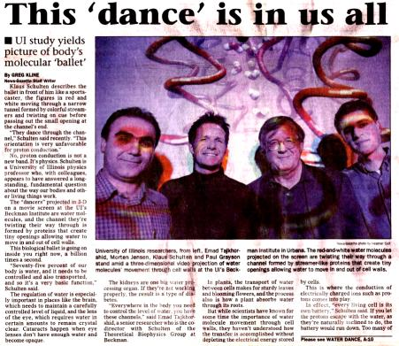
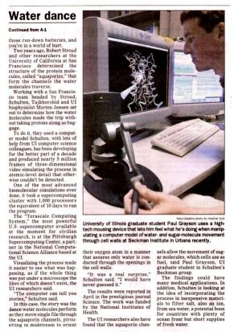

## Scientific publications

* <a href="publications/grayson2007a.pdf"><i>Real time observations of
  single bacteriophage &lambda; DNA ejections in vitro.</i></a> Paul
  Grayson, Lin Han, Tabita Winther, and Rob Phillips. PNAS, September
  5, 2007. [<a
  href="publications/grayson2007-supplement/">supplementary
  information</a>]
* <a href="publications/grayson2007.pdf"><i>Is phage DNA "injected"
  into cells - biologists and physicists can agree.</i></a> Paul
  Grayson and Ian J. Molineux. Current Opinion in Microbiology, August
  20, 2007.
* <a href="publications/garcia2007.pdf">
<i>Biological Consequences of Tightly Bent DNA: The Other Life of a
Macromolecular Celebrity.</i></a> Hernan G. Garcia, Paul Grayson, Lin
Han, Mandar Inamdar, Jan&eacute; Kondev, Philip C. Nelson, Jonathan
Widom and Paul A. Wiggins.  Biopolymers 85(2):115-130 (2007).
* <a href="publications/grayson2006.pdf">
<i>The Effect of Genome Length on Ejection Forces in Bacteriophage
Lambda.</i></a> Paul Grayson, Alex Evilevitch, Mandar M. Inamdar,
Prashant K. Purohit, William M. Gelbart, Charles M. Knobler, and Rob
Phillips. Virology, 2006, 348(2):430-436, 2006.
* <a href="publications/purohit2005.pdf">
<i>Forces During Bacteriophage DNA Packaging and Ejection.</i></a>
Prashant Purohit, Mandar Inamdar, Paul Grayson, Todd Squires,
Jan&eacute; Kondev, and Rob Phillips. Biophysical Journal, 88:851-866,
2005.
* <a href="publications/lu2003.pdf">
<i>Conductance and physical asymmetry of the Escherichia coli
glycerol facilitator GlpF.</i></a>  Deyu Lu, Paul Grayson, and Klaus
Schulten.  Biophysical Journal, 85:2977-2987, 2003.
* <a href="publications/grayson2003.pdf">
<i>Mechanisms of selectivity in channels and enzymes studied with
interactive molecular dynamics.</i></a> Paul Grayson, Emad Tajkhorshid,
and Klaus Schulten.  Biophysical Journal, 85:36-48, 2003.
* <a href="publications/stone2001.pdf">
<i>A System for Interactive Molecular Dynamics Simulation.</i></a> John
E. Stone, Justin Gullingsrud, Klaus Schulten, Paul Grayson. In <i>2001
ACM Symposium on Interactive 3D Graphics</i>, John F. Hughes and Carlo
H. Sequin, editors, pages 191-194, New York, 2001, ACM SIGGRAPH.

## External Presentations

* <a href="presentations/20070514-thesis-defense.pdf"><i>Watching phage
&lambda; ejection: towards a single-molecule Hershey-Chase
experiment.</i></a> Thesis defense, Caltech, May 14, 2007.
* Real time visualization of genome ejection from
bacteriophages. Single Molecule Biophysics Conference, Aspen, CO,
2007.
* <a href="presentations/200701-puebla-poster.pdf"><i>The role of pressure in DNA ejection from bacteriophage &lambda;.</i></a> Poster for <a href="http://www.cmu.edu/smsl/events/PCAMBProgram.html">PCAMB</a> Conference, Puebla, Mexico, 2007. (1200k PDF)
* Real time visualization of genome ejection from bacteriophage
lambda: how internal pressure drives the translocation of DNA. Special
Biophysics Seminar, Northwestern University, Evanston, IL, 2006.
* Pressure in bacteriophages. Theoretical Biophysics Seminar,
University of Illinois, Urbana, IL, 2005.

* Viruses: designed by evolution, constrained by physics. Guest
lecture for Nature's Designs, an undergraduate course at the Art
Center, Pasadena, CA, 2005.
* Pressure in bacteriophages. Phage/Virus Assembly Meeting, Winter
Park, CO, 2005.
* <a href="presentations/200502-bps-poster.pdf"><i>Measurements of
pressurized DNA in phage capsids.</i></a> Poster for Biophysical
Society Meeting, 2005. (800k PDF)

## Education

* Ph.D. in Physics, with Prof. Rob Phillips. California Institute of Technology, 2002-2007.
  * Studied the role of internal pressure in DNA delivery by viruses,
  focusing on the tailed dsDNA bacteriophage family, including phages
  lambda, phi29, T5, and P22.  We successfully measured the internal
  pressure of lambda at 20-25 atm and observed DNA ejection in real
  time, determining a velocity of up to 60 kbp/s.  This kind of analysis
  required a variety of bulk and single-molecule techniques including
  theoretical modeling of phages at many levels.
    <object width="400" height="300" type="application/x-shockwave-flash" data="http://www.youtube.com/v/1WXx5Jas7SM"><param
value="http://www.youtube.com/v/1WXx5Jas7SM" name="movie"> </object>
* Graduate research with Prof. Klaus Schulten. University of Illinois,
Urbana-Champaign, 2001-2002.
  * Implemented the new technique Interactive Molecular Dynamics,
  interfacing molecular dynamics simulations to haptic force-feedback to
  allow users to literally feel simulated molecules. Contributed this
  feature to the source code of VMD and NAMD, the group's molecular
  visualization and simulation software, in parallel with scientific
  studies on the bacterial aquaglyceroporin GlpF and glycerol kinase.
  
  
* S.B. in Physics with Electrical Engineering. Massachusetts
Institute of Technology, 2001.
* S.B. in Mathematics. Massachusetts Institute of Technology,
2001.

## Erdős path

1. <a href="publications/grayson2006.pdf">
<i>The Effect of Genome Length on Ejection Forces in Bacteriophage
Lambda.</i></a> Paul Grayson, Alex Evilevitch, Mandar M. Inamdar,
Prashant K. Purohit, William M. Gelbart, Charles M. Knobler, and Rob
Phillips. Virology, 2006, 348(2):430-436, 2006.
2. Gelbart, William M.; Rice, Stuart A.; Freed, Karl F. Stochastic theory of vibrational relaxation and dissociation. J. Chem. Phys. 52 1970 5718–5732.
3. Helfand, Eugene; Rice, Stuart A. Principle of corresponding states for transport properties. H. Chem. Phys. 32 1960 1642–1644.
4. Kac, M.; Helfand, E. Study of several lattice systems with long-range forces. J. Mathematical Phys. 4 1963 1078–1088.
5. Erdös, P.; Kac, M. The Gaussian law of errors in the theory of additive number theoretic functions. Amer. J. Math. 62, (1940). 738–742.

## Random things

* <a href="rates">Diffusion through an asymmetric channel should be symmetric at low concentration.</a>
* <a href="zoo">My bacteriophage zoo.</a>
