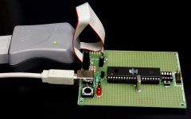

<big><b>NOTE: The note below is out of date!</b></big>  Instead of an
mbed, I recommend a micropython-compatible board such as the
[Raspberry Pi
Pico](https://www.raspberrypi.com/products/raspberry-pi-pico/) or [BBC micro:bit](https://microbit.org/).

<big><b>NOTE: This page is old and out of date!</b></big>  I do not think
hobbyists should be using AVRs any more, but if you want to, it is
much easier now, since the relevant packages are available in standard
linux distributions.  Instead of an AVR-based board I would recommend
getting a <a href="http://www.pololu.com/catalog/product/1336">Pololu
Wixel</a>, which is about $20 and comes with wireless and USB, or
an <a href="http://www.pololu.com/catalog/product/2150">mbed</a>,
which has a powerful 32-bit processor, tons of peripheral features,
and a web-based development environment that requires NO software or
driver installation.</b>

<b>The following information is of historical interest only.</b>

<h2>Introduction</h2>

The <a href="http://en.wikipedia.org/wiki/AVR">Atmel AVR family</a> is
a set of powerful microcontrollers that were designed to be used with
the C programming language.  You can now compile a C program for
the AVRs with <a href="http://gcc.gnu.org/">gcc</a>, then load the
program onto the chip using an inexpensive programmer and free tools.  For
Linux users who want to work on digital electronics, robotics, and
automation, these chips are the way to go.  This page is a
step-by-step tutorial that presents the simplest, cheapest way to
start experimenting with AVRs.

Specifically, on this page you'll find instructions for assembling and
programming the AVR <a
href="http://www.avrfreaks.net/Devices/devices.php?action=1&devid=69">ATmega32</a>
using a <a href="http://www.olimex.com/dev/">AVR-P40-USB prototyping
board</a> from Olimex (available at <a
href="http://www.sparkfun.com/shop/index.php?shop=1&cat=8">Sparkfun</a>)
and an AVR programmer that can be purchased from <a
href="http://www.digikey.com/">Digi-key</a>.  The ability to install
programs on your Linux computer is the only skill required.  It will
cost you about $60 and 50M of disk space, and you'll be up and running
about three hours after you unpack the electronics.

<h2>1. Order electronic parts</h2>

Order the AVR-P40-USB from <a
href="http://www.sparkfun.com/shop/index.php?shop=1&cat=8">Sparkfun</a>;
buy it with the USB extension cable - this will be used for power and
serial communication (total price: $37.50).  Also order the <a
  href="http://www.digikey.com/scripts/DkSearch/dksus.dll?PName?Name=ATAVRISP-ND&amp;Site=US">ATAVRISP-ND programmer</a> for $29 from Digi-key.
As long as you are putting in Digi-key order, you'll want to get some
miscellaneous electronics for future experimentation.  That is however
beyond the scope of this tutorial.

<h2>2. Plug in</h2>

After familiarizing yourself with your new electronics, attach the
rubber feet to the prototyping board, connect the usb cable to your
computer, and attach the programmer via serial port as shown.  The
LED on the programmer will cycle through several colors and stop on
green if everything is okay.

<h2>3. Install software</h2>

You'll need a computer running linux to get gcc running; you could
probably also set this stuff up under cygwin.  I used Slackware 10,
but the same instructions should work on any modern linux system.

Get binutils-2.16 from <code>ftp://ftp.gnu.org/gnu/binutils/</code>.
Untar the archive and make a separate directory in which to build it.
From this directory, install with

<blockquote>

<pre>
../binutils-2.16/configure --target=avr --prefix=/usr/local/atmel
make
make install
</pre>

</blockquote>

Get gcc-core-4.0.1 from <code>ftp://ftp.gnu.org/gnu/gcc/</code>. Again make a separate directory and
install with

<blockquote>

<pre>
export PATH=/usr/local/atmel/bin:$PATH
../gcc-4.0.1/configure --target=avr --prefix=/usr/local/atmel --enable-languages=c
make
make install
</pre>

</blockquote>

Get the latest <a href="http://www.nongnu.org/avr-libc/">avr-libc</a>.

<blockquote>

<pre>
./configure --build=`./config.guess` --host=avr --prefix=/usr/local/atmel>
make
make install
</pre>

</blockquote>

Get the latest <a
href="http://savannah.nongnu.org/projects/uisp/">Uisp</a>, the program
you will use to access the AVRISP.  Install with

<blockquote>

<pre>
./configure
make
make install
</pre>

</blockquote>

<h2>Try a simple program</h2>

Save this code as <code>blink.c</code>:

<blockquote>
<pre>
#define F_CPU 10000000UL
#include &lt;avr/io.h&gt;
#include &lt;avr/delay.h&gt;

void delayms(uint16_t millis) {
  uint16_t loop;
  while ( millis ) {
    _delay_ms(1);
    millis--;
  }
}

int main(void) {
  DDRB |= 1&lt;&lt;PB0; /* set PB0 to output */
  while(1) {
    PORTB &= ~(1&lt;&lt;PB0); /* LED on */
    delayms(100);
    PORTB |= 1&lt;&lt;PB0; /* LED off */
    delayms(900);
  }
  return 0;
}
</pre></blockquote>

And save this as <code>Makefile</code>:

<blockquote><pre>
CC=/usr/local/atmel/bin/avr-gcc
CFLAGS=-g -Os -Wall -mcall-prologues -mmcu=atmega32
OBJ2HEX=/usr/local/atmel/bin/avr-objcopy 
UISP=/usr/local/bin/uisp 
TARGET=blink

program : $(TARGET).hex
	$(UISP) -dprog=stk500 -dserial=/dev/ttyS1 --erase -dpart=atmega32
	$(UISP) -dprog=stk500 -dserial=/dev/ttyS1 --upload -dpart=atmega32 \
		if=$(TARGET).hex -v=2
%.obj : %.o
	$(CC) $(CFLAGS) $&lt; -o $@

%.hex : %.obj
	$(OBJ2HEX) -R .eeprom -O ihex $&lt; $@

clean :
	rm -f *.hex *.obj *.o

</pre></blockquote>

With the programmer plugged in, type <code>make</code>.  Your LED
should now start to blink!

<h2>Further reading</h2>
<ul>
<li><a href="http://www.nongnu.org/avr-libc/">The avr-gcc homepage</a>
contains essential documentation on the software base you need to use
to write programs for the ATmega32.  This is where to look for the
definition of predefined functions like <code>sbi</code>.
<li><a
href="http://www.atmel.com/dyn/products/product_card.asp?part_id=2014">The
offical Atmel page on ATmega32</a> has the complete manual.
<li><a href="http://gcc.gnu.org/onlinedocs/gcc-3.4.2/gcc/">The gcc
documentation</a> has lots of help on compiler options.
<li><a
href="http://www.avrfreaks.net/Devices/devices.php?action=1&devid=69">The
AVR Freaks page on ATmega32</a> links to lots of information about the
chip and related software and hardware.
</ul>

Finally, much of this page was inspired by <a
href="http://www.linuxfocus.org/English/March2002/article231.shtml">Guido
Socher's 2002 article</a> on avr-gcc.  It's slightly out of date now but
still contains a lot of useful details that I haven't gone into here.

