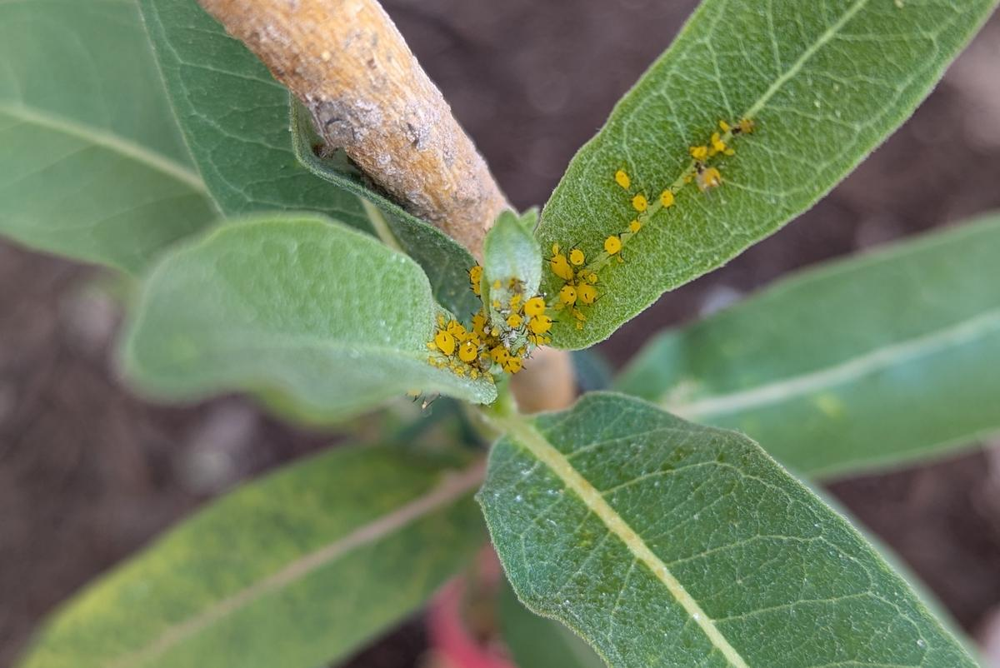

Gardening is about balance between the plants you want and the
undesirable weeds and pests that you don't. Here in the Las Vegas
valley, a garden full of pretty green things is so far away from the
natural state that it can be hard to find that balance. You plant a
bunch of stuff that looks great in the spring but then quickly gets
discovered by hungry insects, which multiply and overwhelm the plants
during the difficult summer. (Example: grapes and leafhoppers.)
Spraying pesticides can be a solution if you notice in time, but that
keeps the garden out of balance, so you have to keep spraying over and
over to keep it under control.

In a natural environment, pests are eventually limited by the growth
of natural predators. So I'd like more predators in the garden, but
how do I encourage that without all my plants constantly being
infested by pests?

One possible approach comes from
[milkweed](https://en.wikipedia.org/wiki/Asclepias) (*Asclepias*) and
the [oleander aphid](https://en.wikipedia.org/wiki/Aphis_nerii)
(*Aphis nerii*):

<figure class='image'>

<figcaption>Desert milkweed (Asclepias subulata) with the new growth on the left colonized by oleander aphids</figcaption>
</figure>

The oleander aphid is a bright yellow aphid that feeds primarily on
the abundant latex sap of milkweed and related plants such as
oleander. I grow several kinds of milkweed in my garden and every
plant seems to get absolutely covered with oleander aphids within a
few weeks of sprouting.

<figure class='image'>

<figcaption>Showy milkweed (Asclepias speciosa) colonized by oleander aphids</figcaption>
</figure>

While most of the aphids are flightless, a few of them grow
wings, enabling them to spread over long distances. With so much
oleander growing all over the valley, these aphids are unavoidable.

Oleander aphids can stunt the growth of milkweed, but they will not
usually kill it completely, and these aphids don't seem to be
interested in other plants in my garden. Over the years I've also
noticed a variety of predator insects that feed on oleander aphids,
which suggested an idea to me: **use milkweed around other plants to
farm large quantities of aphids and encourage the growth of
predators.**

I like this idea and am working on building up my milkweed crop but so
far don't have enough yet to make much of a difference. For now,
here's a collection of some of the fun predators I've seen on the
plants.

## Ladybug

[Ladybugs
(*Coccinellidae*)](https://en.wikipedia.org/wiki/Coccinellidae) are
not "true bugs" but are well-known aphid eaters in both their larval
and adult forms. These were not common when at first, and
I introduced them intentionally several times by purchasing a pack
from the garden store. Now they seem to have become established and
come back every year.

<figure class='image'>

<figcaption>Adult seven-spotted ladybug (*Coccinella septempunctata*)
feeding on oleander aphids</figcaption>
</figure>

I have not seen ladybug larvae on milkweed yet.

## Assassin bug

The [assassin bugs
(*Reduviidae*)](https://en.wikipedia.org/wiki/Reduviidae) are a large
family of bugs with piercing mouthparts that in many species are used
for hunting. These are "true bugs" with immature nymph forms that look
and behave similarly. I found this adult on my milkweed:

<figure class='image'>

<figcaption>Assassin bug (<i>Zelus tetracanthus?</i>) feeding on oleander aphids</figcaption>
</figure>

## Hoverfly larva

The syrphid fly or hoverfly is a bee mimic that hovers in place while
looking for a good spot to land. If it has eggs to lay, that good spot
would be near a source of aphids, since its larval form is a voracious
predator:

<figure class='image'>

<figcaption>Hoverfly larva among oleander aphids</figcaption>
</figure>

The larva looks kind of like a blob of mucus; I didn't realize what it
was at first.

<figure class='image'>

<figcaption>Syrphid larva hunting aphids, also an aphid zombie</figcaption>
</figure>

In this last picture, note that one of the aphids is inflated and
brown. That brings us to the next topic:

## Parasitic wasps (*Aphidius*)

One of the most effective factors limiting aphid populations seems to
be infection by [parasitic
wasps](https://en.wikipedia.org/wiki/Aphidius). These tiny wasps lay
their eggs in the bodies of the aphids, which then become inflated and
hard brown "aphid zombies". Eventually the new adult wasps emerge from
a hole on the body. You can see several stages (aphid, zombie, and
zombie with exit hole) on this showy milkweed leaf:

<figure class='image'>

<figcaption>"Aphid zombies" parasitized by wasps</figcaption>
</figure>

The wasps themselves are hard to find in the wild since they are so
tiny and probably only stay around for a few days to mate and lay
their eggs. So, I collected a few aphid zombies in a small glass vial
and waited. After a week or so I found these wasps in the vial:

<figure class='image'>

<figcaption>Aphid zombies and a newly-emerged parasitic wasp (<em>Aphidus
colemani?</em>)</figcaption>
</figure>
<figure class='image'>

<figcaption>Close-up of the newly-emerged parasitic wasp, about 1.5 mm
long</figcaption>
</figure>

## Tarantula hawk wasp

This one does not eat aphids and so is not really part of my system,
but I wanted to include it since it's a real apex predator!

<figure class='image'>

<figcaption>Tarantula hawk feeding on desert milkweed</figcaption>
</figure>

The [Tarantula hawk](https://en.wikipedia.org/wiki/Tarantula_hawk) is
a huge wasp that paralyzes tarantulas and drags them into a burrow as
food for its young. It is known for having one of the most painful
stings in the world and also happens to love feeding on desert
milkweed. I'm not sure that this particular predator is useful for the
rest of my garden, but it's pretty cool to see.

## See also

* [Gaia Garden: Predators and Parasites on Oleander (Milkweed) Aphids](https://gaiagarden.blogspot.com/2017/08/predators-and-parasites-on-oleander_22.html)
* [Oleander Aphids - Buggy Joe](https://610wtvn.iheart.com/featured/ron-wilson/content/2022-08-12-oleander-aphids-buggy-joe/)
