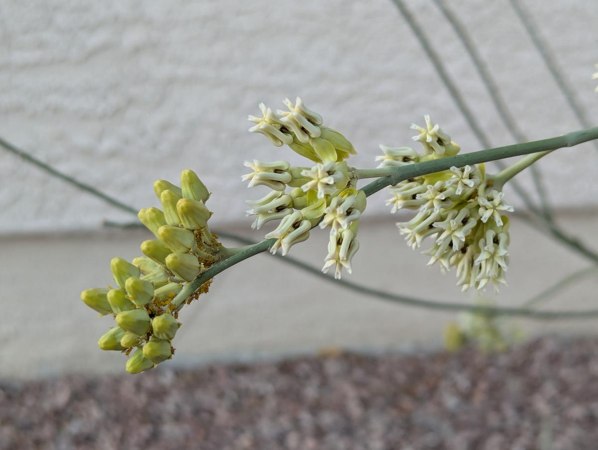
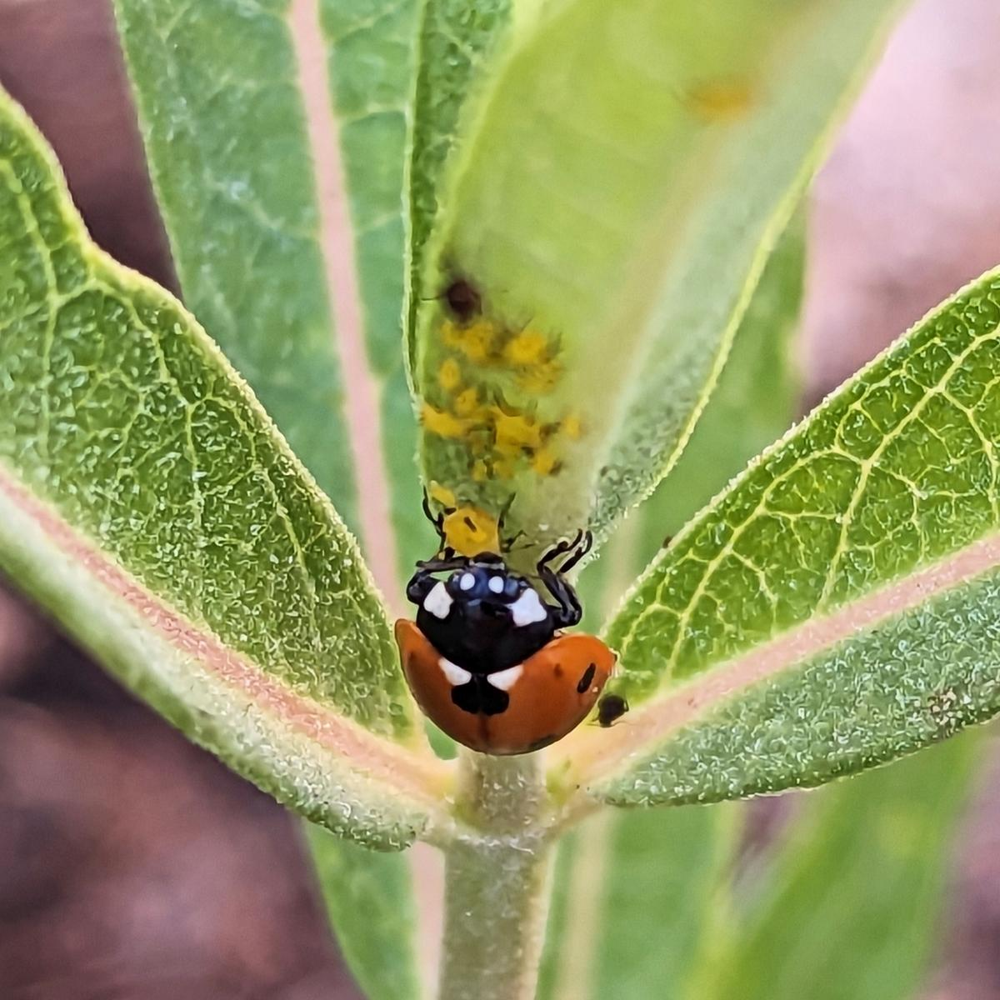
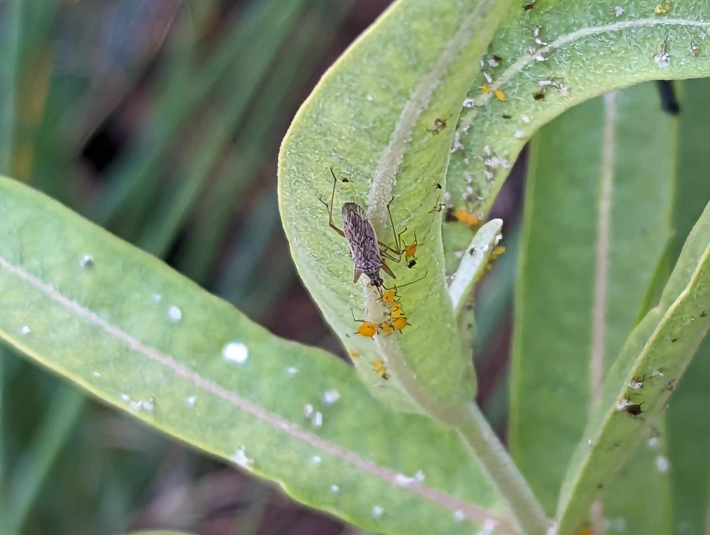
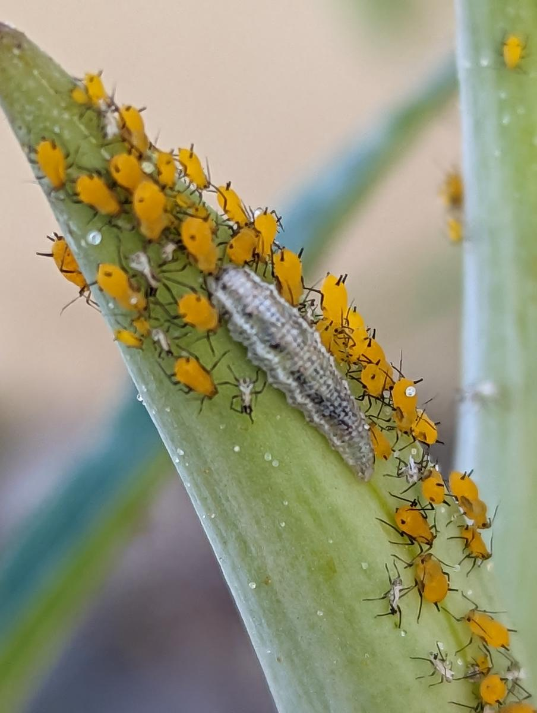
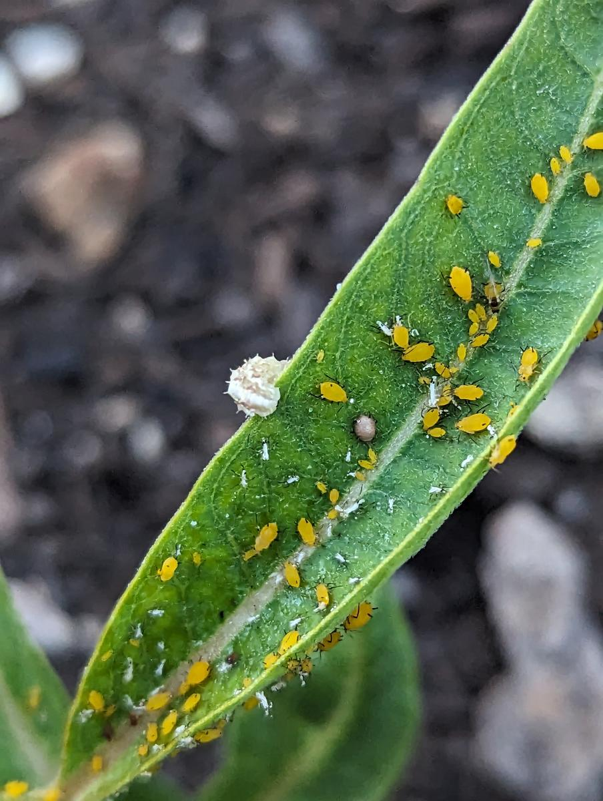
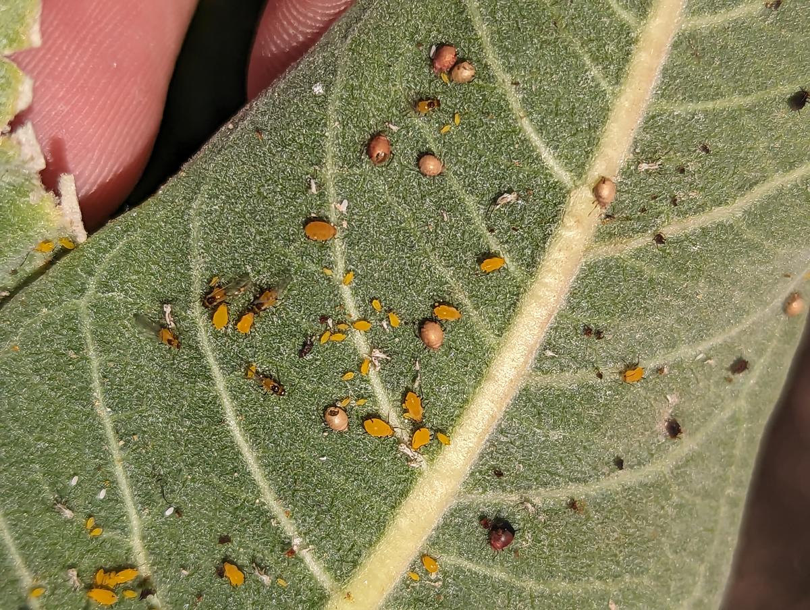
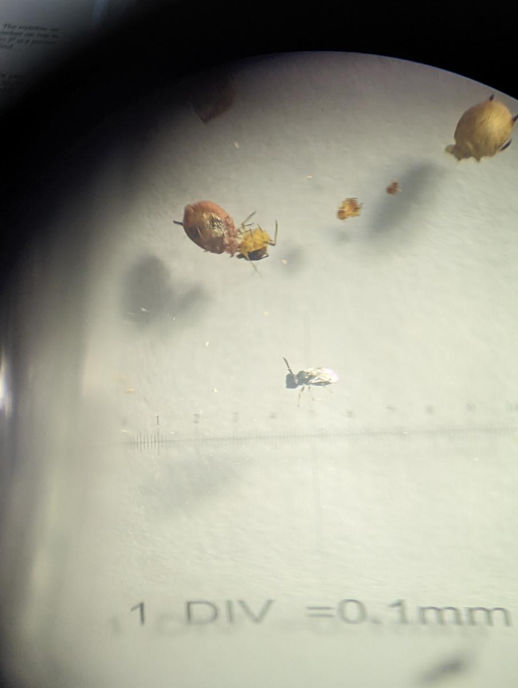
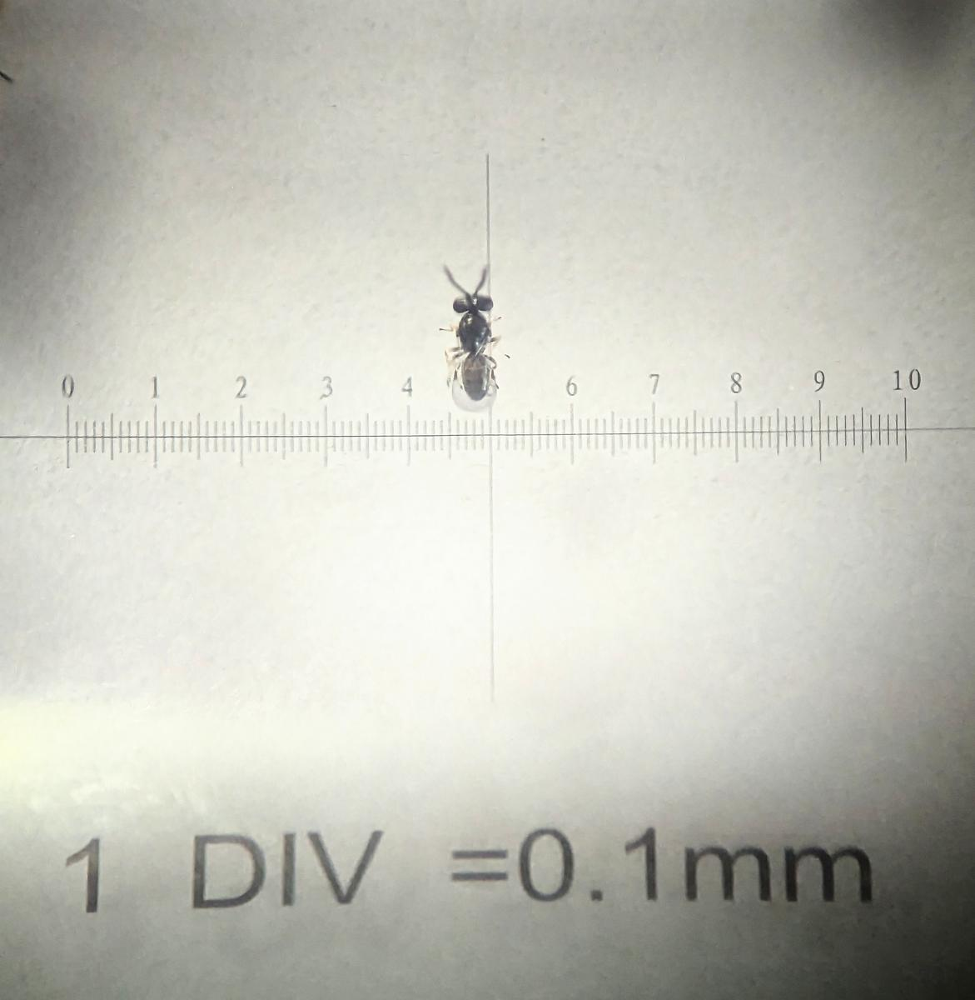
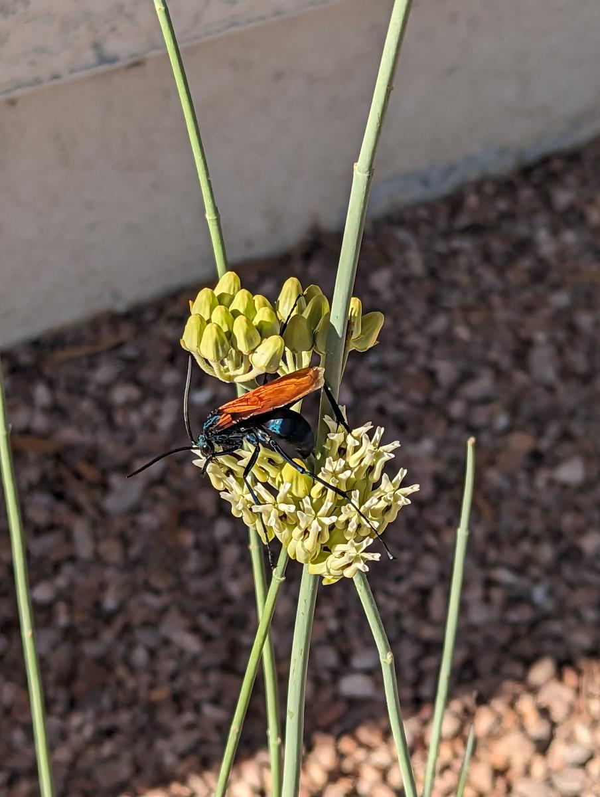

Gardening is about finding a balance between the plants you want and
the undesirable weeds and pests that you don't. Here in the Las Vegas
valley, a garden full of pretty green things is so far away from the
natural state that it can be hard to find that balance. You plant a
bunch of stuff that looks great in the spring but then quickly gets
discovered by hungry insects, which multiply and overwhelm the plants
during the difficult summer. Spraying pesticides is an easy solution,
but that keeps the garden out of balance, so you have to keep spraying
over and over to keep it under control.

In a natural environment, pests are eventually limited by the growth
of natural predators. So I'd like more predators in the garden, but
how do I encourage that without all my plants constantly being
infested by pests?

One possible approach comes from
[milkweed](https://en.wikipedia.org/wiki/Asclepias) (*Asclepias*) and
the [oleander aphid](https://en.wikipedia.org/wiki/Aphis_nerii)
(*Aphis nerii*):

<figure class='image'>

<figcaption>Desert milkweed (Asclepias subulata) with the new growth on the left colonized by oleander aphids</figcaption>
</figure>

The oleander aphid is a bright yellow aphid that feeds primarily on
the abundant latex sap of milkweed and related plants such as
oleander. I grow several kinds of milkweed in my garden and every
plant seems to get covered with oleander aphids within a few weeks of
sprouting. While most of the aphids are flightless, a few of them grow
wings, enabling them to spread over long distances. With so much
oleander growing all over the valley, these aphids are unavoidable.

Oleander aphids can severely damage milkweed, but they will not
usually kill it completely, and these aphids don't seem to be
interested in other plants in my garden. Over the years I've also
noticed a variety of predator insects that feed on oleander aphids,
which suggested an idea to me: **use milkweed around other plants to farm large quantities of aphids and encourage the growth of predators.**

## Ladybug

## Lacewing

## Assassin bug

## Syrphid fly larva

## Parasitic wasps

## Tarantula hawk wasp

