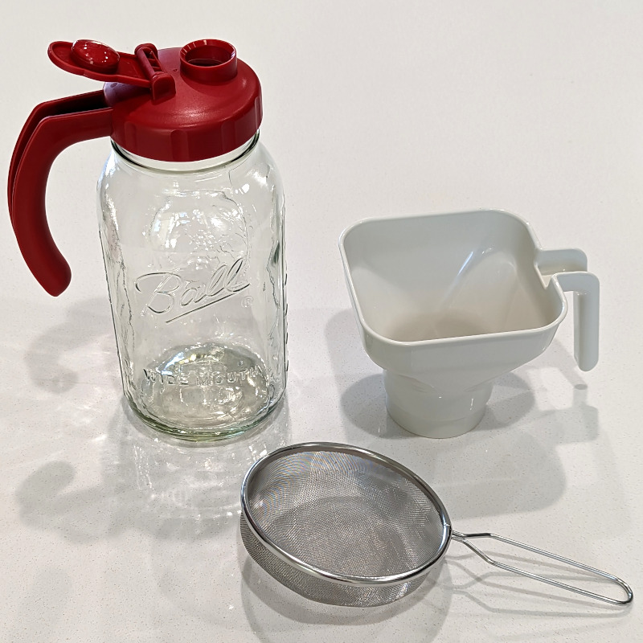
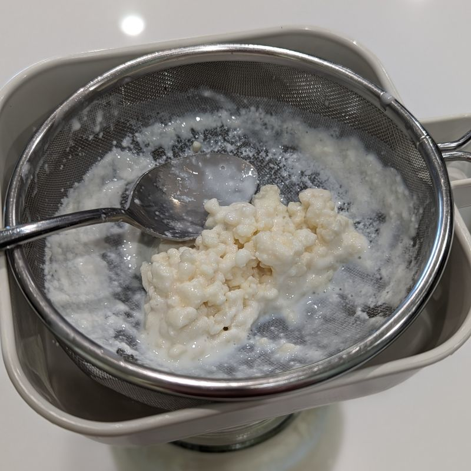
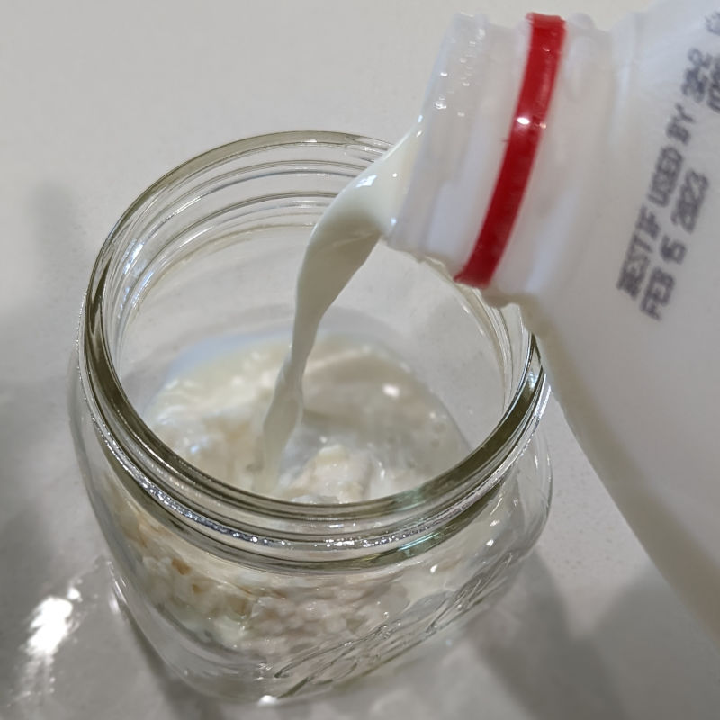
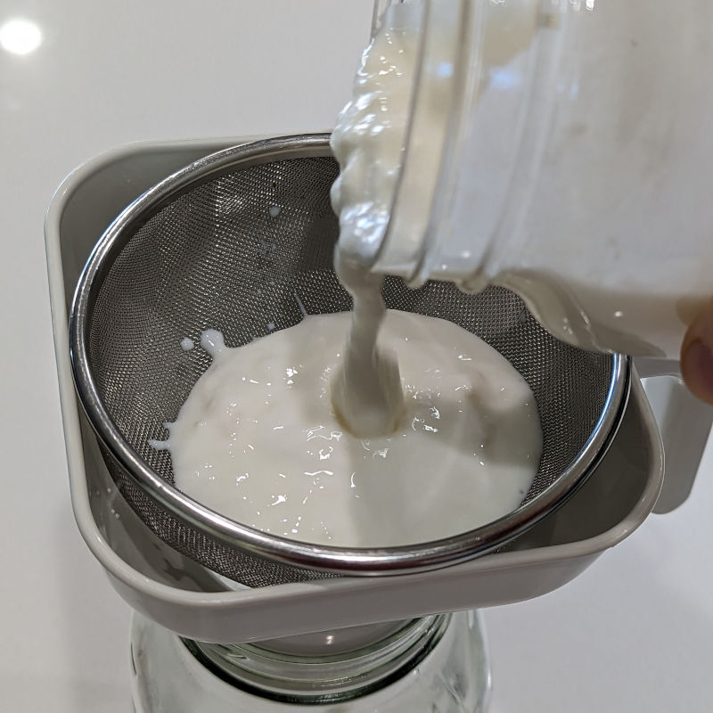
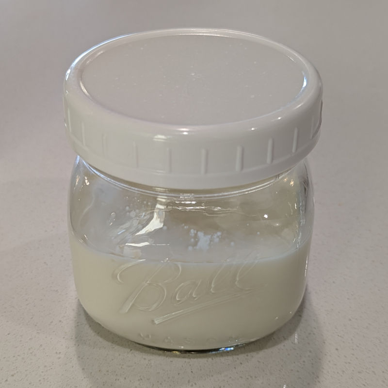
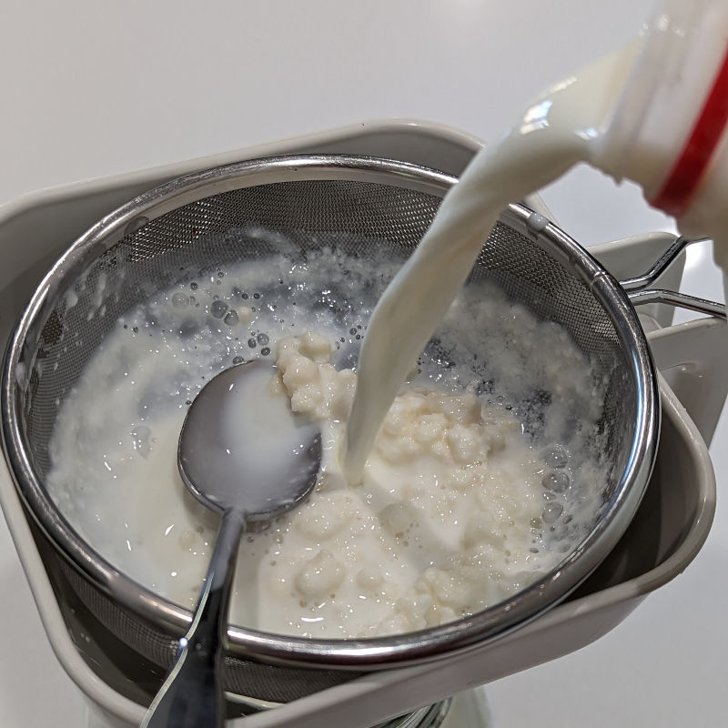
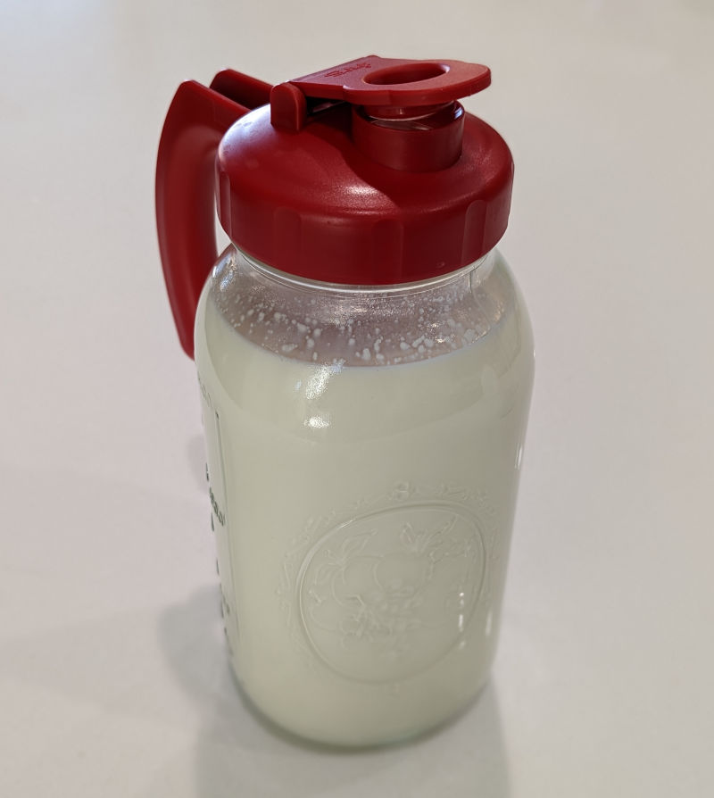
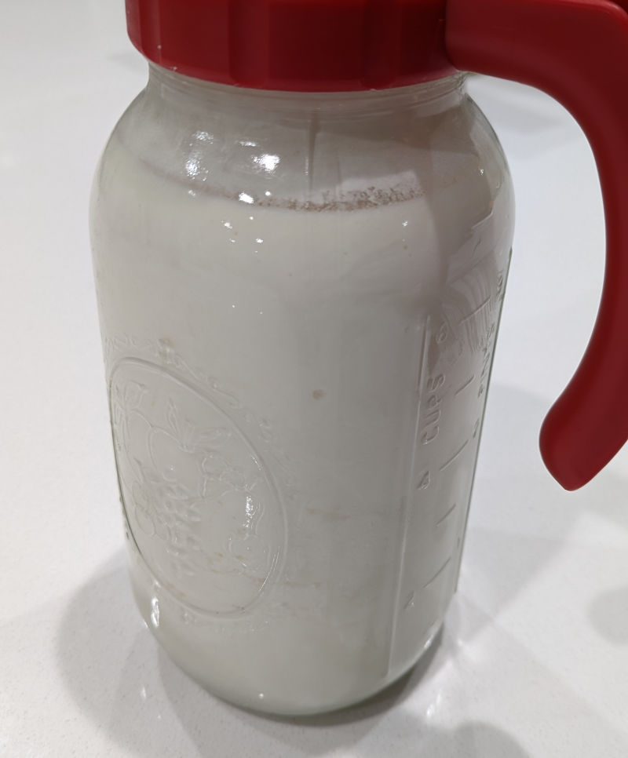
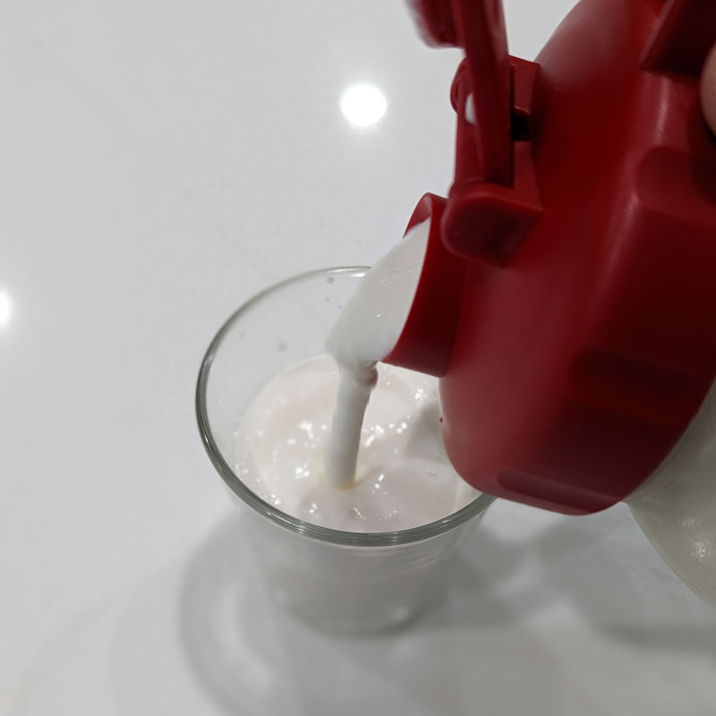

Kefir is a fermented milk product similar to a drinkable
yogurt.  It is made from *kefir grains*, which are rubbery
structures formed by some of the bacteria involved in
fermentation. A variety of bacteria and yeasts inhabit the kefir
grains and perform fermentation.

It is possible that kefir's unique properties are closely related
to the uniqueness of the kefir grains, which are a somewhat magical
substance of unknown origin.  Nobody knows how to make kefir grains
from scratch, so they are passed from person.  Unlike yogurt, which
relies on precise temperature control and is always at risk of
contamination, kefir ferments perfectly at a variety of room
temperatures, and the culture can survive being ignored for weeks in
the fridge or mailed to a friend across the country. Maybe the grains
provide hiding places for the microorganisms to use when conditions
are tough? Or could they be uniquely suited for growing only the
correct species when conditions are good? Whatever the reason, you
won't have much luck making kefir without the grains.

The traditional method involves fermenting a batch of kefir with
its grains, then separating them in a strainer. I made kefir this way
for several years, and straining the grains was always the biggest
pain of the whole process.  It can take 10 minutes to get all the
thick kefir strained slowly through a metal sieve. Recently I have
realized that you can cheat a bit to make the whole process much
easier, and I'll describe my alternative "lazy method" here.

## Lazy method

The basic idea is to ferment just a small quantity (1 cup) with the
grains, then strain this small amount into a larger container for
final fermentation.  This seems to work okay, and it has a few benefits:

* Much less time straining.
* Only a small primary fermentation container needs cleaning afterward.
* The grains are maintained in a consistent process, instead of being
  passed through containers of various sizes.
* You can wash the grains with milk (maybe this helps the desired
  microorganisms somehow?)

There is a small *disadvantage* to this method that it is more
sensitive to the timing and probably starting conditions.  So if my
grains have been sitting in the fridge for more than a day, I always
go through a cycle or two of initial fermentation without using the
product to make a large batch.  And if I over-ferment the single cup,
the large batch comes out lumpy - it's still perfectly drinkable but
needs stirring or blending into a smoothie.  The key seems to be to
strain it into the final container when it is only slightly thickened,
not yet beginning to separate.

You will need some small ~16 oz containers (oops, not pictured), a
64 oz serving pitcher, and a funnel with matching strainer:

## Detailed process

<table class="kefir">
<tr>
<td>
 
Start with 1-2 tbsp strained kefir grains.
</td>
<td class="arrow">&#129094;</td>
<td>
 
Mix with ~1 cup of fresh, cold milk in a small container.
</td>
</tr><tr>
<td class="arrow">&#129093;</td>
<td class="arrow"></td>
<td class="arrow">&#129095;</td>
</tr><tr>
<td>
 
When the liquid has slightly thickened, strain into 64 oz jar.
</td>
<td class="arrow">&#129092;</td>
<td>
 
Close (not airtight!) and leave on the counter for 6 hours or more.
</td>
</tr><tr>
<td class="arrow">&#129095;</td>
<td></td>
<td></td>
</tr><tr>

</tr><tr>
<td>
 
Pour more milk through the grains to fill the jar.
</td>
</tr><tr>
<td class="arrow">&#129095;</td>
<td></td>
<td></td>
</tr><tr>
<td>
 
Cover (not airtight!) and leave on the counter.
</td><td rowspan="3"></td>
</tr><tr>
<td class="arrow">&#129095;</td>
<td></td>
<td></td>
</tr><tr>
<td>
 
After 8-24 hours (depending on temperature) the milk should be thick
and show bubbles or separation.
</td>
</tr><tr>
<td class="arrow">&#129095;</td>
<td></td>
<td></td>
</tr><tr>
<td>
 
Refrigerate and serve.  I like it with flavored stevia drops.
</td>
</tr>
</table>
