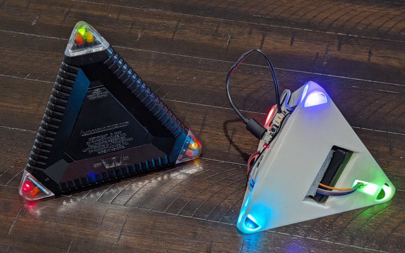

*Luminations*, the black pyramid shown below, is a classic electronic
puzzle relased by Random House in 1989. It has the shape of a
tetrahedron, with red, green, and yellow LED lights at each
corner. Rotating the tetrahedron changes the colors according to a
secret rule, and the goal is to get each corner to show a steady red.

Jaap Scherphuis has [a thorough
page](https://www.jaapsch.net/puzzles/luminat.htm) describing the
puzzle, and for some more technical info you can see [US Patent
4957291](https://patents.google.com/patent/US4957291A/en), so I won't
get into the details of how it works here.

I will say that what makes it so interesting is that to solve it, you
have to first discover the rule, and then figure out a practical way
to attack it. In that way it's kind of reminiscent of
[*Eleusis*](https://en.wikipedia.org/wiki/Eleusis_(card_game)) or
[*Zendo*](https://boardgamegeek.com/boardgame/6830/zendo).

I also appreciate the simplicity of an interface that's purely
inertial - without any buttons or moving parts.

Luminations was invented before blue LEDs and according to
the patent, used a 4-bit microcontroller with only 128 4-bit words of
RAM. So we should be able to make something much better these days.

The white pyramid right is my successor project concept.  At its core
is a Python-programmable [BBC micro:bit](https://microbit.org/), which
includes plenty of processing power, the accelerometer needed for the
inertial user interface, and a speaker for sound effects. Four RGB
LEDs are installed in the corners, and everything is powered by a
rechargeable 4xAAA battery pack.

The 3D files are available [on
GitHub](https://github.com/pdg137/luminations) but are very much a
work in progress. For example the wires run outside along the surface,
the USB connector sticks way out, and everything is held in place by
hope. The current version does seem at least good enough for
firmware development.

Programming ideas:

* Create a general framework for implementing rules
* Re-implement the original 5 levels exactly as before
* Redo the original 5 levels with rainbow colors and no flashing/black
* Zendo mode where the device invents a new rule every time
* Completely different kinds of games like [Simon](https://en.wikipedia.org/wiki/Simon_(game))

Please contact me if you're interested in collaborating on this project!