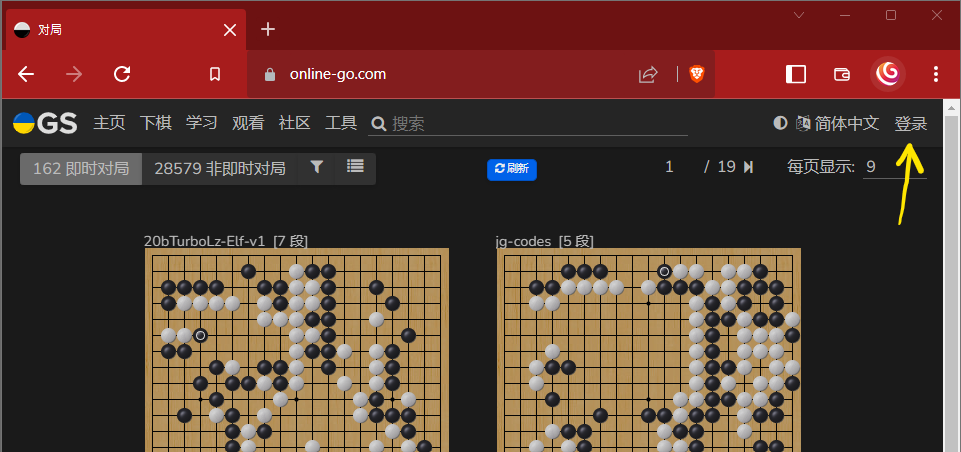
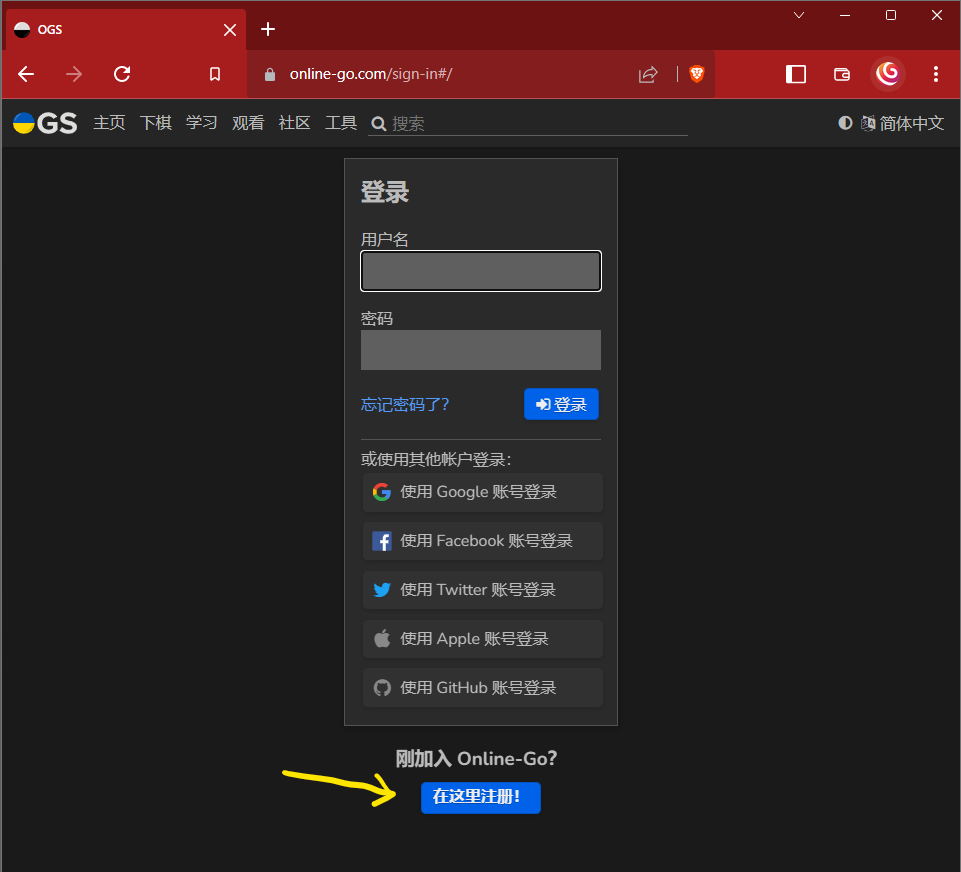
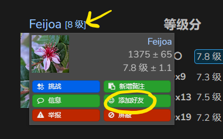
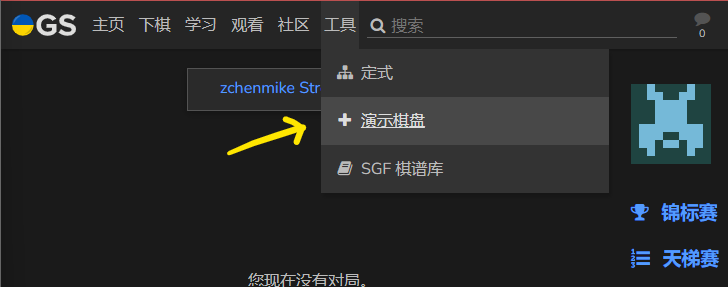
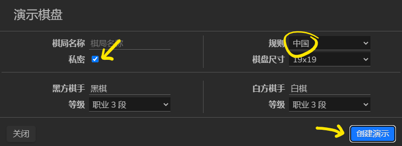
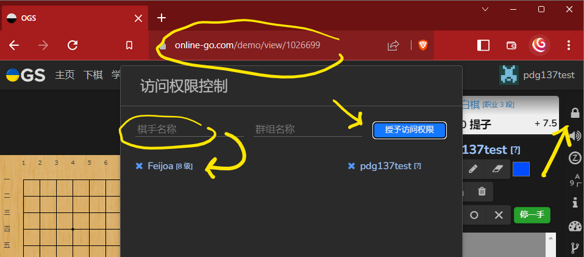
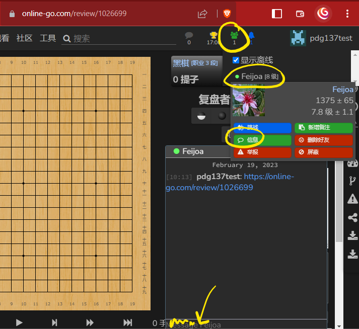
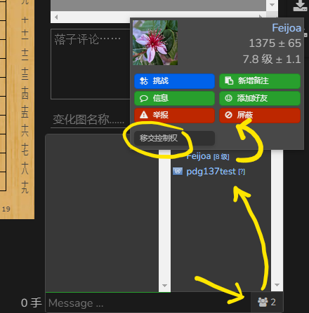

1. 访问[online-go.com](https://online-go.com/)并点击 "登录"。 
   
3. 点击 "在这里注册！"。设置你的账户并登录。 
   
4. 搜索学生。 
   
5. 再次点击他们的名字，把他们加为好友。 
   
6. 选择 "演示棋盘" 。 
    
7. 选择 "私密" 和 中国规则。 
   
8. 点击 "访问权限设置"，添加你的学生，名字就会出现在列表中。 
   
9. 将演示板的URL发送给你的学生。 
   
10. 使用工具来编辑黑板。 
11. 点击 "移交控制权"，让学生控制黑板。点击你的名字
    来取回控制权。 
    
