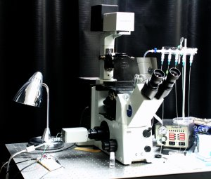
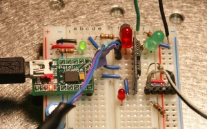
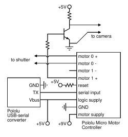
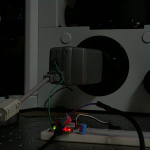
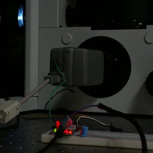

<h2>Introduction</h2>

I'm a graduate student in a <a
href="http://www.rpgroup.caltech.edu">physical biology laboratory</a>
at Caltech.  The researchers in my group are working on several
different experiments to study forces and motion on the scale of cells
and molecules, so we need microscopes, especially <em>fluorescence
microscopes</em> &mdash; microscopes that use a very bright blue or
green light source to track the motion of particles that fluoresce in
the light.  There's a picture of one of our fluorescence microscopes
at the right.  The experiment that is run on this particular
microscope involves following slowly moving particles for a very long
time (many hours) and recording the video on a computer with a digital
microscope camera.  Unfortunately, five hours is more than enough time
for the bright light to <em>bleach</em> the fluorescent dye in the
particles, just as a bright red shirt left out in the sun gets
bleached to pink in a few days.  The particles effectively disappeared
before we could finish the video.

So what we needed to do is turn the light on only when we are taking a
picture, using a shutter.  Microscope shutters aren't too expensive,
so we bought one.  It consists of a small DC motor and a black metal
paddle; applying a voltage to the motor moves the paddle over to block
the light beam, and reversing the voltage lets the light through
again.  However, for some unknown reason, the electronics required to
control one of these shutters costs around $2,500, and it isn't even
compatible with our camera's software; we were looking at paying over
$3,500 to get the shutter working in our setup.

 

<h2>Building a shutter control circuit </h2>

The solution?  Build the shutter controller ourselves.  It seemed like
a simple enough project, because a DC motor is easy to control.
Ideally, we would have been able to write a program on the computer
that would open the shutter, take a picture, then close the shutter
again.  However, the software that controls our camera (like almost
all software found in a biology lab) was not designed with any level
of programmability in mind.  Luckily, the camera, like most microscope
cameras, can be put into an externally triggered mode.  In the
triggered mode, a TTL (5V) input on the back of the camera signals it
to record a frame of video.  So we needed to send two signals with our
circuit: one to open the shutter, and one to trigger the camera.  The
circuit needed to be controlled by the computer so we could easily
adjust timings on the fly.

 Here's the circuit we built to
control the shutter and camera.  It uses the two motor ports of the <a
href="http://www.pololu.com/products/pololu/0410/">Micro Motor
Controller</a> from <a href="http://www.pololu.com/">Pololu</a> to
control the motor and camera, and a <a
href="http://www.pololu.com/products/pololu/0391/">USB-Serial
Converter</a> as a connection to the computer.  Total cost for all of
the electronics was about $60, and it required a single afternoon of
assembly and experimentation.

The documentation for the USB-serial converter suggests that most
people only need the ground (GND), receive (RX), and transmit (TX)
lines.  It's not at all clear (and this is a perpetual problem with
serial port documentation), but "receive" means that the signal
travels <em>from</em> the circuit <em>to</em> the computer.  In fact,
we didn't need the RX line at all, since the motor controller does not
need to send any signals back to the computer.  The TX line, on the
other hand, gets connected directly to the "serial control input" line
on the motor controller, and we use both the GND and the +5V lines on
the USB-serial converter to power the motor controller.

A little experimentation with some batteries and DC wall adapters
showed that 5V was not enough to close or open the shutter reliably,
so we couldn't just power the motors from the USB line.  Instead, we
used a 9V DC wall adapter as the motor power supply, plugging its
output directly into pin 1 of the motor controller.  Note that an
unregulated wall adapter rated for 9V actually starts out at around
13V, when no current is applied, putting it out of the specified range
of operation for the motor controller.  So if we burn it out, it will
be our fault.

 

The motor controller is designed to control two reversible DC motors;
we use one of its ports in the normal way, by connecting pins 8
and&nbsp;9 on the motor controller (motor&nbsp;0) to the shutter motor
leads.  To control the camera, however, we just use pin 6, the
motor&nbsp;1 positive output.  When motor&nbsp;1 is set to drive
forward with 100% speed, this line will be at +9V, and at 0% speed, it
will be at 0V.  A simple NPN transistor circuit, shown in the diagram
at right, allows us to convert +9V to the +5V required by the camera.
As you can see, we also threw in a bunch of diagnostic LEDs to make
the board more colorful and help us figure out what was going on in
the circuit.

One note of caution: we were doing this with a relatively inexpensive
microscope camera and shutter.  But laboratory equipment can be very
expensive and fragile, and if you do something wrong (e.g. apply +9V
to the camera TTL input) you could instantly destroy it.  So make sure
you know what you are doing, test everything before you plug it in,
and keep in mind that if you aren't getting some educational value out
of the process, it is probably not worthwhile to do it yourself!

 

<h2>Software control</h2>

We downloaded the drivers for the USB-serial converter from the 
<a href="http://www.pololu.com/products/pololu/0391/">converter
page</a>, and installed them on the Windows computer that we use to
record video from the camera.  The port showed up as COM3 in Windows;
within our <a href="http://www.cygwin.com/">Cygwin</a> shell it is
called <code>/dev/ttyS2</code>.  A simple C program was sufficient to drive
the shutter and camera; to learn how to write programs that use the
serial port in the Cygwin environment,
<a href="http://www.pololu.com/projects/prj0003/">follow this
tutorial</a>.

<h2>Conclusion</h2>

After the circuit was assembled and the program written, the shutter
worked exactly as planned.  We could open it or close it in about a
tenth of a second, take an exposure with the camera, and close it
again.  Here are pictures of the shutter opening:

It works!  If you are interested in doing something like this in your
lab, and you need some advice, please let <a
href="http://www.rpgroup.caltech.edu/~grayson">Paul</a> know.

 
<!--#include virtual="/footer_buttons.html" -->
